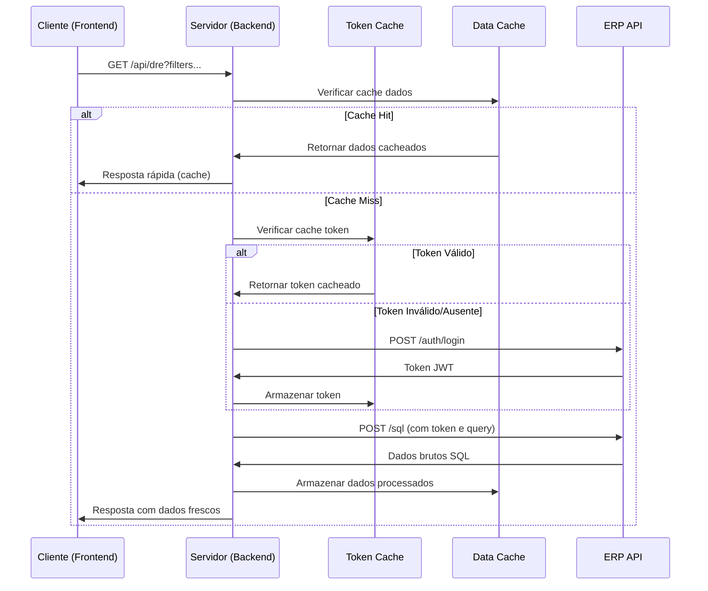

# Arquitetura e Implementação

## Visão Arquitetural

O Dashboard DRE segue uma arquitetura **cliente-servidor monolítica** com separação clara de responsabilidades entre frontend e backend.

```
┌─────────────────┐    HTTP/REST     ┌─────────────────┐    HTTPS/REST     ┌─────────────────┐
│                 │   ──────────────> │                 │   ──────────────> │                 │
│   Frontend      │                   │   Backend       │                   │   ERP Externo   │
│   (Browser)     │                   │   (Node.js)     │                   │                 │
│                 │   <──────────────  │                 │   <──────────────  │                 │
└─────────────────┘                   └─────────────────┘                   └─────────────────┘
     │                                        │                                        │
     │                                        │                                        │
     ▼                                        ▼                                        ▼
┌─────────────────┐                   ┌─────────────────┐                   ┌─────────────────┐
│                 │                   │                 │                   │                 │
│  HTML/CSS/JS    │                   │  Express.js     │                   │  REST API       │
│  Bootstrap 5.3  │                   │  Node Cache     │                   │  JWT Auth       │
│  Chart.js       │                   │  Axios          │                   │  SQL Endpoint   │
│                 │                   │                 │                   │                 │
└─────────────────┘                   └─────────────────┘                   └─────────────────┘
```

## Estrutura do Projeto

```
dre-dashboard/
├── server.js                 # Servidor principal Express.js
├── package.json              # Dependências e scripts
├── package-lock.json         # Lock de dependências
├── .env                      # Variáveis de ambiente
├── public/                   # Arquivos estáticos frontend
│   ├── index.html           # Página principal
│   ├── dashboard.js         # Lógica JavaScript
│   ├── styles.css          # Estilos customizados
│   └── assets/             # Imagens e recursos
├── scripts/                  # Scripts utilitários
│   └── start.sh            # Script de inicialização
├── docs/                     # Documentação
└── node_modules/            # Dependências Node.js
```

## Backend - Arquitetura Detalhada

### Componentes Principais

#### 1. Servidor Express.js (`server.js`)

**Middleware Configurado:**
```javascript
// Segurança (apenas em produção)
if (process.env.NODE_ENV !== 'development') {
  app.use(helmet());
}

// Otimização de performance
app.use(compression());

// Controle de acesso
app.use(cors({
  origin: ['http://localhost:13456', 'http://127.0.0.1:13456'],
  credentials: true
}));

// Parsing de requests
app.use(express.json());
app.use(express.static(path.join(__dirname, 'public')));
```

#### 2. Sistema de Cache

**Implementação Dual:**
```javascript
// Cache para tokens de autenticação (50 minutos)
const tokenCache = new NodeCache({ stdTTL: 3000 });

// Cache para dados da DRE (30 minutos)  
const dataCache = new NodeCache({ stdTTL: 1800 });
```

**Estratégias de Cache:**
- **Token Cache**: Evita re-autenticação constante no ERP
- **Data Cache**: Reduz carga no ERP e melhora tempo de resposta
- **Key Generation**: Chaves baseadas em combinação de filtros para cache preciso

#### 3. Cliente HTTP com Axios

**Configuração de Timeout e Retry:**
```javascript
const apiClient = axios.create({
  timeout: 30000,
  headers: {
    'Content-Type': 'application/json',
    'Accept': 'application/json'
  }
});
```

### Fluxo de Processamento de Requisições

#### 1. Requisição de Dados DRE



#### 2. Processamento de Consulta SQL

**Query SQL Principal:**
```sql
SELECT 
    centro.codigo as centro_codigo,
    centro.descricao as centro_descricao,
    conlan.valor as valor,
    conlan.datamov as data_movimento,
    clacon.descricao as linha_dre,
    clacon.codigo as linha_dre_codigo,
    CASE centro.codigo
        WHEN 231 THEN 'ADM.FINANCEIRO'
        WHEN 82 THEN 'ADM.FINANCEIRO'
        -- ... mais mapeamentos
        ELSE 'NAO CLASSIFICADO'
    END as departamento
FROM con_lancon conlan
INNER JOIN con_lanca conlanc 
    ON conlan.codigo = conlanc.codigo 
INNER JOIN con_clacon clacon 
    ON conlanc.conclaconcodigo = clacon.codigo
INNER JOIN con_placont plano 
    ON conlanc.conplacodigo = plano.codigo
INNER JOIN con_custo centro 
    ON conlan.concustocodigo = centro.codigo
WHERE conlan.datamov BETWEEN ? AND ?
    AND conlanc.situacao = 'N'
    AND clacon.codigo IN (311, 312, 321, 32201, 32202, 313, 314, 32205, 32301, 32303, 324, 3229901)
```

### Tratamento de Erros

#### 1. Middleware de Erro Global

```javascript
app.use((err, req, res, next) => {
  console.error('❌ [Error]', err.message);
  
  if (err.code === 'ECONNREFUSED') {
    return res.status(503).json({ 
      error: 'Serviço ERP indisponível' 
    });
  }
  
  if (err.code === 'ETIMEDOUT') {
    return res.status(504).json({ 
      error: 'Timeout na comunicação com ERP' 
    });
  }
  
  res.status(500).json({ 
    error: 'Erro interno do servidor' 
  });
});
```

#### 2. Resiliência da Conexão

**Estratégias Implementadas:**
- Timeout configurado (30 segundos)
- Tratamento específico para diferentes tipos de erro
- Cache como fallback para indisponibilidade do ERP
- Logs detalhados para diagnóstico

## Frontend - Arquitetura Detalhada

### Componentes Principais

#### 1. Estrutura HTML (`index.html`)

**Seções Principais:**
```html
<!DOCTYPE html>
<html lang="pt-BR">
<head>
    <!-- Meta tags, Bootstrap, Chart.js, Font Awesome -->
</head>
<body>
    <!-- Header com branding e controles -->
    <header class="row bg-primary text-white">
        <!-- Título, botão de atualização -->
    </header>
    
    <!-- Filtros dinâmicos -->
    <section class="row mb-4">
        <form id="filterForm">
            <!-- Data início, Data fim, Departamento, Linha DRE -->
        </form>
    </section>
    
    <!-- Cards de resumo -->
    <section class="row mb-4">
        <!-- Cards: Receitas, Despesas, Resultado, Margem -->
    </section>
    
    <!-- Gráficos e tabelas -->
    <main class="row">
        <!-- Gráfico de barras, Gráfico de pizza, Tabela detalhada -->
    </main>
</body>
</html>
```

#### 2. Lógica JavaScript (`dashboard.js`)

**Módulos de Funcionalidade:**

```javascript
// Estado da aplicação
const appState = {
    currentData: [],
    filters: {
        dataInicio: '',
        dataFim: '',
        departamento: '',
        linhaDRE: ''
    },
    charts: {}
};

// Gerenciamento de API
class APIManager {
    async fetchDREData(filters) {
        // Implementação com retry e tratamento de erro
    }
    
    async fetchDRESummary(filters) {
        // Busca dados agregados
    }
    
    async clearCache() {
        // Limpeza de cache no backend
    }
}

// Renderização de Gráficos
class ChartRenderer {
    createBarChart(data, container) {
        // Chart.js para gráfico de barras
    }
    
    createPieChart(data, container) {
        // Chart.js para gráfico de pizza
    }
    
    createLineChart(data, container) {
        // Chart.js para gráfico de linhas
    }
}

// Gerenciamento de UI
class UIManager {
    updateSummaryCards(data) {
        // Atualiza cards de resumo financeiro
    }
    
    updateLastUpdateTime() {
        // Mostra timestamp da última atualização
    }
    
    showLoadingState() {
        // Indicador de carregamento
    }
    
    showError(message) {
        // Exibição de erros ao usuário
    }
}
```

### Responsividade e Performance

#### 1. Design Responsivo

**Breakpoints Implementados:**
- Mobile: < 576px
- Tablet: 576px - 768px  
- Desktop: > 768px

**Grid Bootstrap 5.3:**
```html
<div class="col-12 col-md-6 col-lg-4"> <!-- Cards responsivos -->
<div class="col-12 col-lg-8"> <!-- Gráfico principal -->
<div class="col-12 col-lg-4"> <!-- Gráfico secundário -->
```

#### 2. Otimizações de Performance

**Frontend:**
- **Lazy Loading**: Gráficos renderizados apenas quando visíveis
- **Debouncing**: Filtros aplicados após delay de digitação
- **Cache Local**: Armazenamento temporário de dados no navegador

**Backend:**
- **Compression**: Gzip nas respostas HTTP
- **Static Caching**: Headers de cache para assets estáticos
- **Connection Pooling**: Reutilização de conexões HTTP

## Integração com ERP

### Protocolo de Comunicação

#### 1. Autenticação OAuth2

```javascript
const authResponse = await axios.post(AUTH_URL, {
    username: 'AGROSS_API',
    password: 'vosa9qta',
    grant_type: 'password',
    client_id: 'null',
    client_secret: 'null'
});

const token = authResponse.data.access_token;
```

#### 2. Execução de Consultas SQL

```javascript
const sqlResponse = await axios.post(SQL_URL, {
    query: dreQuery,
    parameters: [dataInicio, dataFim, /* outros parâmetros */]
}, {
    headers: {
        'Authorization': `Bearer ${token}`
    }
});
```

### Mapeamento de Dados

#### 1. Transformação Departamento → Código

| Departamento | Códigos Centro |
|-------------|----------------|
| ADM.FINANCEIRO | 231, 82, 43, 22 |
| COMERCIAL | 104, 249, 30, 206, 113, 124, 204, 271, 273, 54, 205, 137, 136, 261, 267, 270 |
| DIRECAO | 165, 5, 211, 81 |
| GENTE E GESTAO | 274, 232, 233, 84, 83 |
| ENGENHARIA | 23, 95 |
| PRODUCAO | 209, 9, 108, 65, 72, 87, 160, 32, 207, 8, 88, 234, 210, 237, 17, 144, 33, 90, 14 |
| SUPPLY CHAIN | [códigos específicos] |
| POS VENDA | [códigos específicos] |

#### 2. Categorização Contábil (DRE)

| Linha DRE | Códigos clacon |
|-----------|----------------|
| RECEITA OPERACIONAL LIQUIDA | 311, 312 |
| CPV/CMV/CSP | 321 |
| DESPESAS OPERACIONAIS | 32201, 32202 |
| OUTRAS RECEITAS OPERACIONAIS | 313, 314 |
| OUTRAS DESPESAS OPERACIONAIS | 32205 |
| RECEITAS FINANCEIRAS | 32301 |
| DESPESAS FINANCEIRAS | 32303 |
| RESULTADO NAO OPERACIONAL | 324, 3229901 |
| PROVISAO PARA IR E CSLL | [código específico] |

## Segurança e Boas Práticas

### 1. Segurança de Aplicação

**Implementado:**
- **Helmet**: Headers de segurança HTTP
- **CORS**: Restrição de origens permitidas
- **Input Validation**: Validação de parâmetros de filtro
- **SQL Injection Protection**: Parâmetros em consultas SQL

**Planejado:**
- **Rate Limiting**: Limitação de requisições por IP
- **CSRF Protection**: Tokens anti-CSRF
- **Content Security Policy**: Política de segurança de conteúdo

### 2. Monitoramento e Logging

**Logs Implementados:**
```javascript
console.log('🚀 [Server] Iniciando na porta:', PORT);
console.log('🔐 [Auth] Obtendo novo token do ERP');
console.log('💾 [Cache] Dados cacheados com sucesso');
console.log('❌ [Error] Falha na conexão:', error.message);
```

**Health Checks:**
- Endpoint `/api/health` para monitoramento
- Verificação de status de cache
- Teste de conectividade com ERP

## Escalabilidade e Futuras Melhorias

### 1. Arquitetura Escalável

**Opções de Evolução:**
- **Microserviços**: Separação de frontend/backend/cache
- **Message Queue**: Processamento assíncrono de consultas
- **Database Cache**: Redis para cache distribuído
- **Load Balancer**: Múltiplas instâncias do backend

### 2. Novas Funcionalidades Planejadas

- **Exportação**: PDF/Excel dos relatórios
- **Alertas**: Notificações de anomalias financeiras
- **Comparativo**: Análise year-over-year
- **Drill-down**: Navegação detalhada nos dados
- **Previsões**: Machine learning para projeções

## Conclusão

A arquitetura atual do Dashboard DRE foi projetada para ser:

- **Robusta**: Tratamento comprehensive de erros e resiliência
- **Performática**: Cache inteligente e otimizações diversas  
- **Segura**: Implementação de boas práticas de segurança
- **Flexível**: Preparada para crescimento e novas funcionalidades
- **Mantenível**: Código organizado e documentado

O sistema atende às necessidades atuais da AGROSS enquanto mantém flexibilidade para evoluções futuras.
